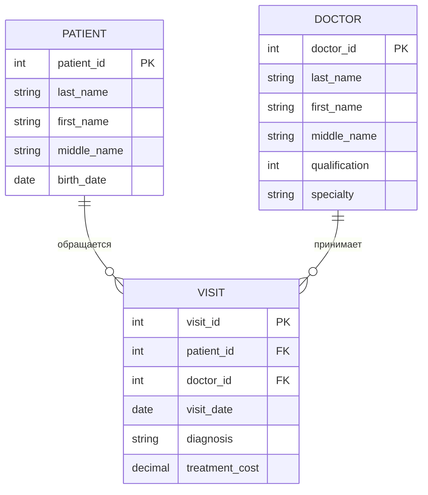

# Обновленная документация

## ER-диаграмма



## Описание таблиц

1. **PATIENT (Пациент)**:
   - patient_id: уникальный идентификатор пациента (первичный ключ)
   - last_name, first_name, middle_name: ФИО пациента
   - birth_date: дата рождения

2. **DOCTOR (Врач)**:
   - doctor_id: уникальный идентификатор врача (первичный ключ)
   - last_name, first_name, middle_name: ФИО врача
   - qualification: квалификация врача
   - specialty: специальность врача

3. **VISIT (Посещение)**:
   - visit_id: уникальный идентификатор посещения (первичный ключ)
   - patient_id: внешний ключ, связывающий с таблицей PATIENT
   - doctor_id: внешний ключ, связывающий с таблицей DOCTOR
   - visit_date: дата посещения
   - diagnosis: установленный диагноз
   - treatment_cost: стоимость лечения

## Выбранная таблица для дальнейшей работы:
**Таблица DOCTOR - Врач**

## Диаграмма классов
```mermaid
classDiagram
    class IDoctor {
        <<interface>>
        +getDoctorId() int
        +getLastName() String
        +getFirstName() String
        +getInitials() String
    }

    class BriefDoctor {
        #int doctorId
        #String lastName
        #String firstName
        +BriefDoctor()
        +BriefDoctor(int, String, String)
        +getDoctorId() int
        +setDoctorId(int)
        +getLastName() String
        +setLastName(String)
        +getFirstName() String
        +setFirstName(String)
        +getInitials() String
        +equals(Object) boolean
        +hashCode() int
        +toString() String
    }

    class Doctor {
        -String middleName
        -int qualification
        -String specialty
        -Doctor(Builder)
        +getMiddleName() String
        +getQualification() int
        +getSpecialty() String
        +getInitials() String
        +static createNewDoctor(String, String, String, int, String) Doctor
        +static updateExistingDoctor(int, String, String, String, int, String) Doctor
        +static createFromString(String) Doctor
        +static createFromJson(String) Doctor
        +toJson() String
        +toString() String
        +equals(Object) boolean
        +hashCode() int
        +isSameBriefDoctor(BriefDoctor) boolean
    }

    class Doctor.Builder {
        -int doctorId
        -String lastName
        -String firstName
        -String middleName
        -int qualification
        -String specialty
        +doctorId(int) Builder
        +lastName(String) Builder
        +firstName(String) Builder
        +middleName(String) Builder
        +qualification(int) Builder
        +specialty(String) Builder
        +build() Doctor
    }

    class DoctorValidator {
        +static validateDoctorId(int)
        +static validateName(String, String)
        +static validateQualification(int)
        +static validateSpecialty(String)
        +static validateDoctor(Doctor)
    }

    IDoctor <|.. BriefDoctor : implements
    BriefDoctor <|-- Doctor : extends
    Doctor *-- Doctor::Builder : uses
    Doctor ..> DoctorValidator : uses
    BriefDoctor ..> DoctorValidator : uses
```
