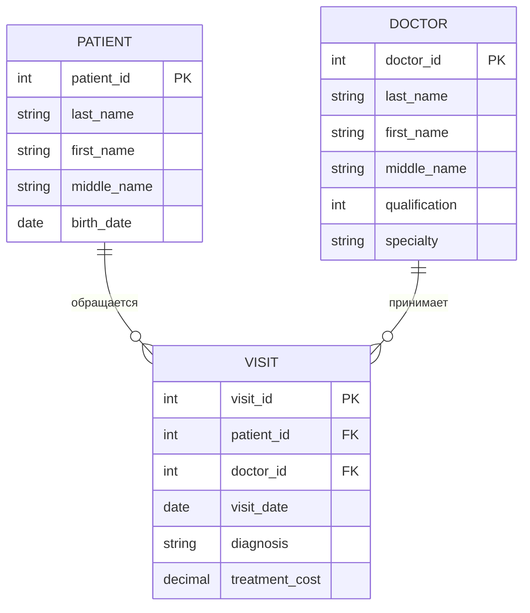
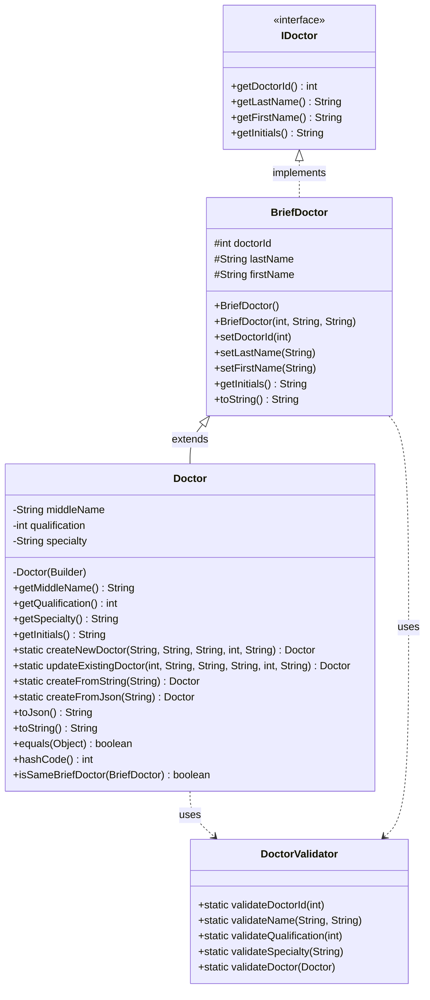
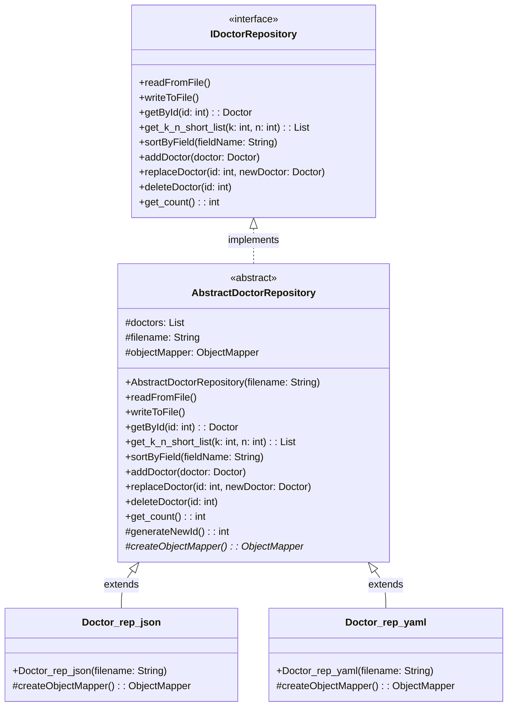

## ER-диаграмма

## Описание таблиц

1. **PATIENT (Пациент)**:
   - patient_id: уникальный идентификатор пациента (первичный ключ)
   - last_name, first_name, middle_name: ФИО пациента
   - birth_date: дата рождения

2. **DOCTOR (Врач)**:
   - doctor_id: уникальный идентификатор врача (первичный ключ)
   - last_name, first_name, middle_name: ФИО врача
   - qualification: квалификация врача
   - specialty: специальность врача

3. **VISIT (Посещение)**:
   - visit_id: уникальный идентификатор посещения (первичный ключ)
   - patient_id: внешний ключ, связывающий с таблицей PATIENT
   - doctor_id: внешний ключ, связывающий с таблицей DOCTOR
   - visit_date: дата посещения
   - diagnosis: установленный диагноз
   - treatment_cost: стоимость лечения

## Выбранная таблица для дальнейшей работы:
**Таблица DOCTOR - Врач**

## Диаграмма классов

## Диаграмма классов парсинга

